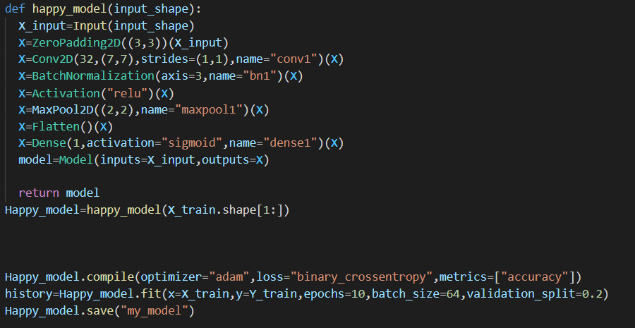
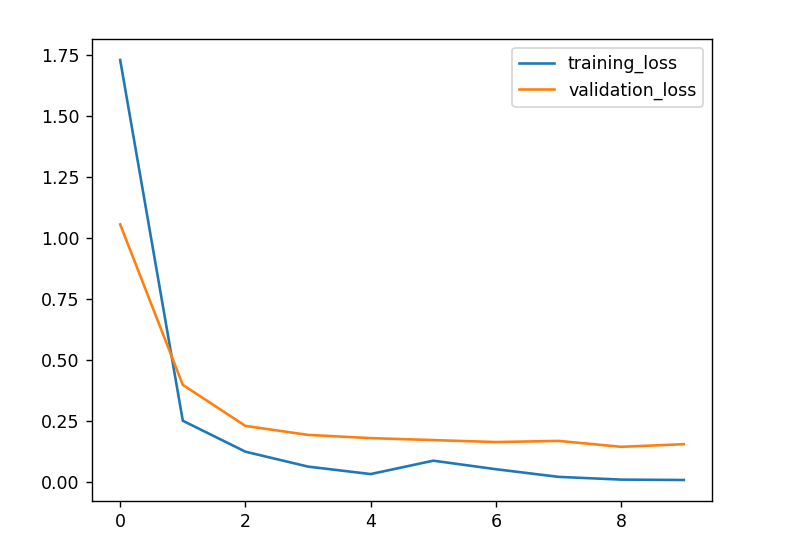
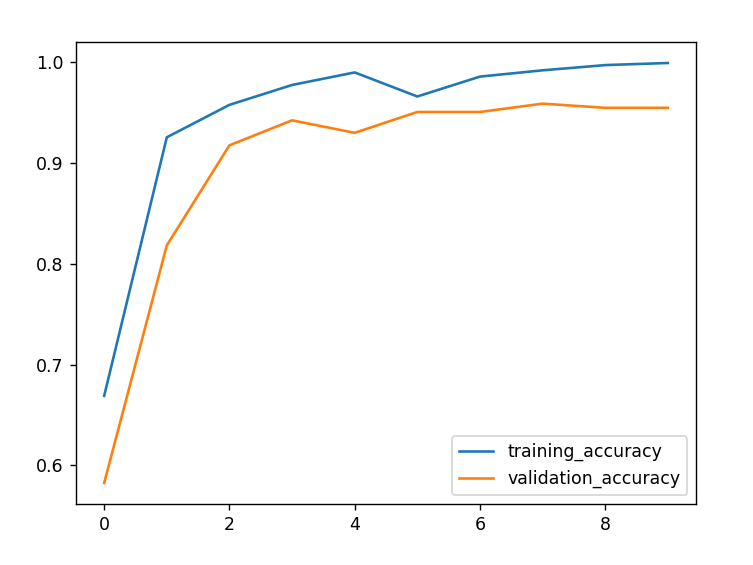
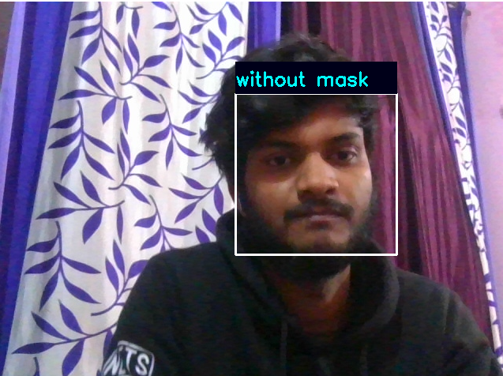

# Mask Detector
Face Detection, a widely popular subject with a huge range of applications. Modern day Smartphones and Laptops come with in-built face detection softwares, which can authenticate the identity of the user. There are numerous apps that can capture, detect and process a face in real time, can identify the age and the gender of the user, and also can apply some really cool filters. The list is not limited to these mobile apps, as Face Detection also has a wide range of applications in Surveillance, Security and Biometrics as well. But the origin of its Success stories dates back to 2001, when Viola and Jones proposed the first ever Object Detection Framework for Real Time Face Detection in Video Footage.

<a href="https://towardsdatascience.com/face-detection-with-haar-cascade-727f68dafd08">Face Detection with Haar Cascade</a>

<u><b>MODEL ARCHITECTURE</b></u>

<u><b>LOSS GRAPHS</b></u>

<b>ACCURACY GRAPHS</b>

<b>REAL TIME RESULTS</b>

